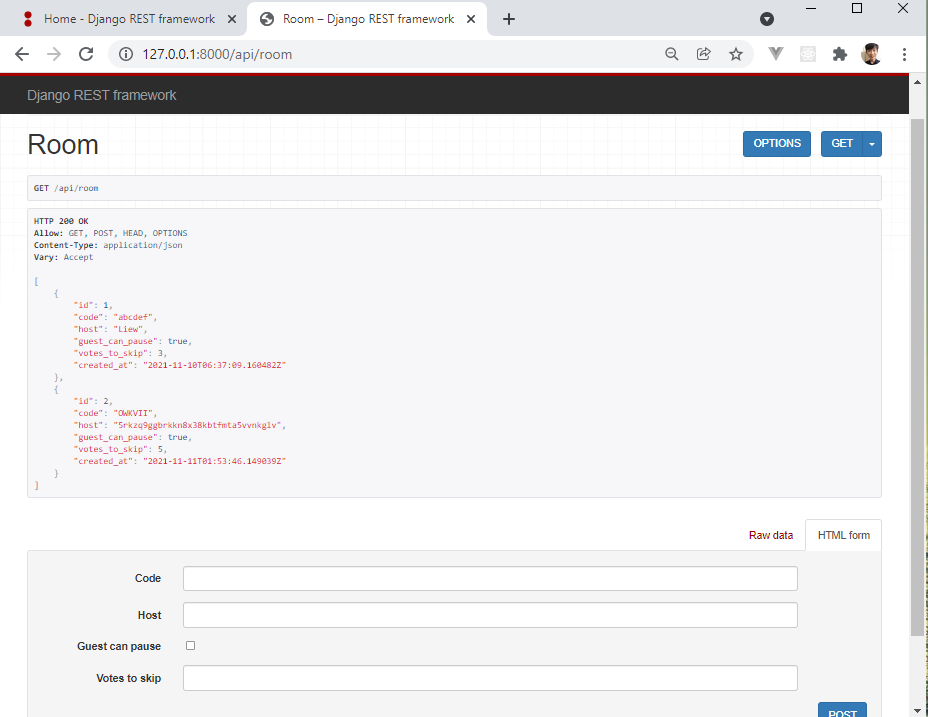

# Django React Tutorial
This is a Django REST Framework and React tutorial following this [youtube tutorial](https://www.youtube.com/watch?v=JD-age0BPVo&list=PLzMcBGfZo4-kCLWnGmK0jUBmGLaJxvi4j) by TechWithTim. The author also uses [valentinog blog](https://www.valentinog.com/blog/drf/) as reference. More resources can be found in [techwithtim github](https://github.com/techwithtim/Music-Controller-Web-App-Tutorial).


## Start
This is how I initialize this project:
```
powershell> python -m virtualenv env
powershell> Set-ExecutionPolicy -Scope CurrentUser
powershell> ExecutionPolicy: RemoteSigned
powershell> env\Scripts\activate
```
You can just initialze a env, and activate it. After env is already setup (don't forget to download libraries based on requirement.txt tpp), the following commands run the server.
```
powershell> env\Scripts\activate
powershell\music_app> python .\manage.py runserver
powershell\music_app\frontend> npm run dev
```

### Tutorial 1 - Introduction
- Installation guide and runserver.

### Tutorial 2 - Django Rest Framework
- Models
- [Serializers](https://www.django-rest-framework.org/api-guide/serializers/) 
- View, using [generic views](https://www.django-rest-framework.org/api-guide/generic-views/#generic-views)



### Tutorial 3 - React Integration Using Webpack & Babel
- Set up: `django-admin startapp frontend`
- Create these directories inside frontend/
```
frontend
|_src
|   |_components
|_static
|   |_css
|   |_frontend
|   |_images
|_templates
    |_frontend
```
- Then, inside frontend/, download this packages
```
> npm init -y
> npm i webpack webpack-cli --save-dev
> npm i @babel/core babel-loader @babel/preset-env @babel/preset-react --save-dev
> npm i react react-dom --save-dev
> npm install @material-ui/core
> npm install @babel/plugin-proposal-class-properties
> npm install react-router-dom
> npm install @material-ui/icons
```
- Then set up webpack.config.js & babel.config.js (follow tutorial)

##### How React gonna works with Django?
- Basically, Django going to render the code and then pass it to react to manage them.
- Things to setup inside frontend/
```
templates\frontend\index.html
src\components\App.js
src\index.js
```
- Then add frontend to installed app
- Make sure frontend/views.py render html
```
def index(request, *args, **kwargs):
    return render(request, 'frontend/index.html')
```
- Run npm dev frontend/ & python runserver in music_app/

### Tutorial 4 - React Router and Building Components
- Reminder: understand the diff between class component & functional component. (After research, functional component is preferred in most cases).
- Also, this tutorial uses {Switch} from react-route-dom. However, Switch is not available in react-route-dom 6. There are a few [solutions](https://stackoverflow.com/questions/63124161/attempted-import-error-switch-is-not-exported-from-react-router-dom?rq=1) to this problem. I attempted to switch `Switch` to `Routes`, but it doesn't work, so I have to downgrade react-route-dom to v5.2 to use `Switch`.

### Tutorial 5 - Handling POST Request (Django REST)
- Handling post request basically requires 2 things, a new class in views.py and serializers
- Check out api/views.py `CreateRoomView` class for detailed info

### Tutorial 6 - Material UI Components
- This tutorial basically just deal with RoomCreatePage component only
- Used a lot of [Material UI](https://mui.com/) components, need more study on them
- The UI communicate to the backend API via browser built-in [Fetch API](https://developer.mozilla.org/en-US/docs/Web/API/Fetch_API). In react, you can use [any AJAX library](https://reactjs.org/docs/faq-ajax.html) you like


### Tutorial 7 - Calling API Endpoints From React
Checklist for what to do to add 1 feature
- Add the new UI component in frontend
- Add the new url in api/urls.py
- Add the new controller in api/views.py (make sure the serializer works properly)

### Tutorial 8 - Creating The Room Join Page


More demo images are inside [demo-images](./demo-images/) folder.
